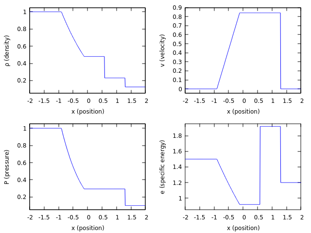
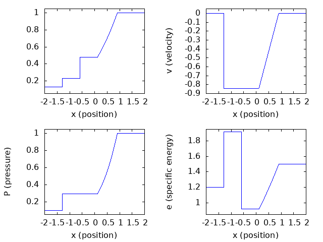

# SodSolver
SodSolver provides an exact solution to the Sod Shock tube problem.   The solver is written in modern Fortran and core arithmetic is carried out in quadruple precision to give at least 15 digits of accuracy making the solution usable as a verification test for double precision computational hydrodynamics codes.   

## The Sod shock tube problem

The Sod shock tube problem for the  1-D Euler equations of inviscid, compressible hydrodynamics posed as a verification test problem by Gary Sod (1978)[^1]is an example of an initial value Riemann Problem.
The solution of the problem is known exactly although it does require finding the root of a real nonlinear equation numerically.  
The problem as stated by Sod is specifies the values for the density $\rho$, the pressure $P$, and the velocity $v$ in left and right initial states surrounding the location of $x=0$.  The exact problem as specified by Sod is
```math
\left(
\begin{array}{l}
\rho_L\\
P_L\\
v_L
\end{array}
\right)
=
\left(
\begin{array}{l}
1.0 \\
1.0 \\
0
\end{array}
\right)
```
for the left initial state where $x < 0$ and
```math
\left(
\begin{array}{l}
\rho_R\\
P_R\\
v_R
\end{array}
\right)
=
\left(
\begin{array}{l}
0.125 \\
0.1 \\
0
\end{array}
\right)
```
for the right initial state where $x \ge 0$.   The problem is evolved forward in time.
The specification of the problem is completed by specifying an equation of state of the 
form  $P = K \rho^\gamma$
where $\gamma$ is the adiabatic index of the gas.  In his original paper Sod took the value of $\gamma = 1.4$,  appropriate for a diatomic ideal gas such as molecular oxygen or molecular nitrogen.  In practice the value of $\gamma=5/3$, reflective of a monatomic ideal gas, is used for numerical verification testing.

## The Structure of the Exact Solution
For the exact solution of the weak form of the Euler equations we follow the notation
of LeVeque (2002)[^2]  The solution of the Sod problem consists of a series of five regions which we list in order, from left to right:

<ol type="I">
  <li> A constant region with initial left state values for density, pressure, and velocity.  </li>
  <li> A rarefaction wave </li>
  <li> A constant region bounded by a contact discontinuity on the right. </li>
    <li> A constant region bounded by a shock wave on the right.  </li>
    <li> A constant region with initial right state values of density, pressure, and velocity.  </li>
</ol>

In regions III & V the pressure has the intermediate value $P_\ast$ and the velocity has the intermediate value $v_\ast$.
The density in each of these regions, 
for the Sod initial conditions and $\gamma=5/3$, is shown at $t=0.7$ seconds in the plot below .

## Calculating the Exact Solution

The first step in finding the exact solution of the Riemann problem posed by Sod is to calculate the intermediate pressure $P_\ast$ that spans 
regions III & V by solving the nonlinear equation 
``` math
f_L(P_\ast) + f_R(P_\ast) = 0.
```
In this case $f_L$ is determined by the equations governing the rarefaction
``` math
f_L(P_\ast) = \frac{2 c_L}{\gamma-1}
\left( \left(\frac{P_\ast}{P_L}\right)^\beta -1 \right)
```
where $c_L$  is the sound speed in the region I given by
```math
c_L = \sqrt{\frac{\gamma P_L}{\rho_L}}.
```

## The Solution Code and Demonstration Programs 

The Fortran subroutines in this repository calculate the exact solution and demonstrates the use of the subroutine in the demonstration programs.   Fortran was chosen as the programming language in order to allow the use of quadruple precision arithmetic.   Carrying out  the calculations in quadruple precision allows the interative Newton-Raphson procedure used to solved the equation for the intermediate pressure to converge to a solution with and error tolerance of $10^{-16}$ which (assuming the the input left and right states have values on the order of unity) produces a solution of sufficient precision for use in verification testing a double precision hydrodynamics code.  A double precision interface to the solver is available
so that the code can be called directly from a double precision hydrodynamic code.
With the exception of the use of quadruple precision variables and arithmetic every effort has been made to make the code compliant with the Fortran 2023 ISO standard and to use modern coding convention including disabling the use of Fortran's implicit declaration scheme through ubiquitous use of the **`implicit none`** statement.

We now describe the code

### The Sod_module.f90 file

The **`Sod_module.f90`** file houses the Fortran module **`sod_module`** which contains three subroutines:
- **`sod_intermediate_pressure`** which calculates the pressure in in regions III & IV by solving a non-linear equation using Newton-Raphson iteration.
- **`sod_solution`** which calculates the value of the density $\rho$, the pressure $P$, and the velocity $v$ of the solution given a position $x$ and time $t$. 
- **`sod_solution_double`** which provides a double precision interface to the
  quadruple precision subroutine **`sod_solution`**.

In addition to the three core subroutines contained in **`sod_module`** there are also
three demonstration programs provided which demonstrate how these subroutines can be used.
  
### The file **`Sod_intermediate_pressure_demo.f90`**
This file contains a program demonstrating the use of the **`sod_intermediate_pressure`** subroutine to find
the intermediate pressure in regions III & IV.

  ### The file **`Sod_solution_demo.f90`**
This file contains a program demonstrating the use of the **`sod_solution`** subroutine to find the density, pressure, velocity, and specific energy as a function of position at a specified time.   The program outputs an ASCII file named **`sod_exact.dat`** from which a plot illustrating the solution can be generated using the **Gnuplot** script 
named **`sod_plot.gp`**.   Issuing the command **`gnuplot sod_plot.gp`** will cause a window to be displayed with the plot.   Editing this script can alternatively produce an image or Postscript file, instead of a new window, with the plot shown below.
.

### The file **`Reverse_Sod_solution_demo.f90`**

This file contains a program demonstrating the use of the **`sod_solution`** subroutine to find the density, pressure, velocity, and specific energy as a function of position at a specified time for the reverse Sod problem in which the left and right initial states are swapped.   This problem produces a shock wave moving to the right and a rarefaction wave propagating to the right.    The program outputs an ASCII file named **`reverse_sod_exact.dat`** from which a plot illustrating the solution can be generated using the **Gnuplot** script 
named **`reverse_sod_plot.gp`**.   Issuing the command **`gnuplot reverse_sod_plot.gp`** will cause a window to be displayed with the plot.   Editing this script can alternatively produce an image or Postscript file, instead of a new window, with the plot shown below.
.   We note that the reverse Sod problem is another important verification test for hydrodynamic codes that can uncover pugs missed 
when only the original Sod problem is used as a test.


    
## References


[^1] Sod, G. A. (1978) "A Survey of Several Finite Difference Methods for Systems of Nonlinear Hyperbolic Conservation Laws" (PDF). J. Comput. Phys. 27 (1): 1–31. Bibcode:1978JCoPh..27....1S. doi:10.1016/0021-9991(78)90023-2. OSTI 6812922.

[^2} LeVeque, R.J. (2002) "Finite Volume Methods for Hyperbolic Problems", Cambridge University Press, ISBN-13 978-0-521-00924-9


$$
